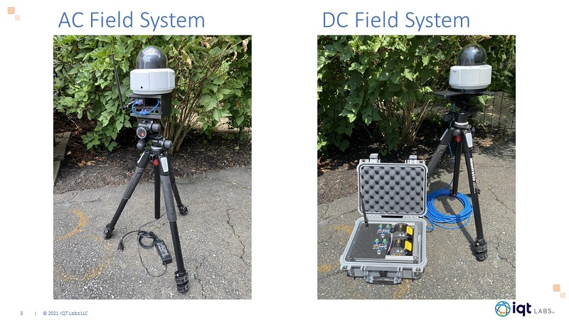

# SkyScan
Automatically photograph planes that fly by!


*Airbus A321 at 32,000 feet*

## Overview
Building image datasets for machine learning applications can be slow and expensive. SkyScan demonstrates a low-cost system that uses sensors to automate the building of datasets appropriate for computer vision models. SkyScan uses a ground-based camera and software-defined radio to capture images and correlated identity information of commercial aircraft. The SkyScan field kit software runs on a Raspberry Pi and all devices are low-power, allowing the system to run for several hours off of a portable battery.

## Table of Contents
1. [How it Works](#how-it-works)
2. [Hardware](#hardware)
3. [Software Architecture](#software-architecture)
4. [ML Pipeline](#ml-pipeline)
5. [Setup and Operation](#setup-and-operation)
6. [Additional Information](#additional-information)

## How it Works
To enable better tracking, most planes broadcast a signal known as [Automatic Dependent Surveillance–Broadcast](https://en.wikipedia.org/wiki/Automatic_Dependent_Surveillance–Broadcast) or ADS-B. This signal is at 1090MHz and can be easily received using a low cost Software Defined Radio (SDR), like the [RTL-SDR](https://learn.adafruit.com/getting-started-with-rtl-sdr-and-sdr-sharp) which repurposes a digital TV chip.

From the ADS-B transmissions, you can get a plane's location and altitude. If you know where a plane is and where you are, you can do some math and point a camera at the plane and take a picture. If you have a Pan/Tilt camera lying around, you can have it automatically track a plane as it flies by and snap photos.

After a dataset has been collected a model can be trained to build a plane detector and classifier using the labeled plane data


## Hardware
This project is built around the RaspberryPi 4, an RTL-SDR, and an Axis PTZ security camera. It could be extended to work with other SDRs or cameras.

Axis has a great API for their network cameras, and it should work with any of there PTZ cameras. The m5525 is nice because it supports continuous 360 degree rotation. You can literally have it spin around in circles, giving you complete coverage. The code has been tested with the 10x zoom [Axis m5525](https://www.axis.com/en-us/products/axis-m5525-e) and the 30x zoom [Axis p5655](https://www.axis.com/en-us/products/axis-p5655-e) cameras.

We are using the [Nooelec NESDR SMArt v4 SDR](https://www.nooelec.com/store/sdr/nesdr-smart-sdr.html) This is nice and stable RTL-SDR. It is compact and doesn't block all the other ports on a Pi. Since you are just trying to capture local planes, you can get away with using any antenna you have lying around.

### Field System Configurations
Two configurations were developed for this project, one with AC and one with DC power input.



### CAD Files 
The major components of the system were modelled in CAD software. A few 3D printed parts were designed to house and mount the things together. These files can be found in the [hardware STL directory](hardware/README.md).

### BOM 
See the [Hardware README](hardware/README.md) for additional component details including a BOM.

## Software Architecture

The different components for this project have been made into Docker containers. This modularity makes it easier to add in new data sources or cameras down the road. We have found containers to work really well on the Pi and the help enforce that you have properly documented all of the software requirements.

````
+-------------+      +-------------+           +---------------+            +--------------+
|             |      |             |           |               |            |              |
|             |      |             |           |               |            |  Axis+PTZ    |
| Pi+Aware    +----->+  ADSB+MQTT  +---------->+ Tracker       +----------->+              |
|             | TCP  |             |  MQTT     |               |  MQTT      |              |
|             |      |             |  all      |               |  only      |              |
+-------------+      +-------------+  planes   +---------------+  tracking  +-------+------+
                                                                  plane             |
                                                                                    | HTTP API
                                                                                    | Pan/Tilt
                                                                                    v
                                +--------------------+                     +--------+---------+
                                |                    |                     |                  |
                                |                    |                     |                  |
                                |   MQTT Broker      |                     |    Axis m5525    |
                                |                    |                     |    Camera        |
                                |                    |                     |                  |
                                |                    |                     |                  |
                                +--------------------+                     +------------------+

````

Here is a brief overview of each component. There are additional details in the component's subdirectory

- [mikenye/piaware](https://github.com/mikenye/docker-piaware) - This is a dockerized version of FlightAware's [PiAware](https://flightaware.com/adsb/piaware/) program. PiAware is actually just a wrapper around [dump1090](https://flightaware.com/adsb/piaware/). Dump1090 is a small program that can use an RTL-SDR to receive an ADS-B transmission. The program uses these transmission to track where nearby planes are and display then on a webpage. It also output all of the messages it receives on a TCP port, for other programs to use. We use this connection to get the plane information. PiAware adds the ability to send the information to FlightAware. You could probably just switch this to only use Dump1090.

- [ADSB-MQTT](adsb-mqtt) Is a small python program that reads in information collected by Dump1090 over a TCP port and publishes all the messages it receives onto the MQTT bus. 

- [tracker](tracker) Receives all of the plane's location, determines how far away from the camera each one is and then finds the closest plane. The location and relative position of the closest plane is periodically published as an MQTT messages. Tracker needs to know the location and altitude of the camera in order to determine the planes relative position.

- [axis-ptz](axis-ptz) Receives updates on which plane to track over MQTT and then directs the PTZ camera towards the plane and takes a picture.

## ML Pipeline

[PUT AN ML SUMMARY HERE]

[Build a plane Detector using Labeled Plane data](ml-model/readme.md)

## Setup and Operation

### Installation
Follow the steps below for installing the edge software.

1. [Install and Configure Raspberry Pi](./configure-pi.md)
2. [Configure PiAware](configure-piaware.md)
3. [Configure Camera](./configure-camera.md)

## System Operation
After the system has been installed, follow the steps below to setup the hardware and start the software.

- [Hardware](hardware.md)
- [Software](software.md)

## Additional Information
Other helpful information about this project

- [Setting up dev containers in VS Code](devcontainers.md)
- [System design notes](design.md)
- [Utilities for testing](utils)
