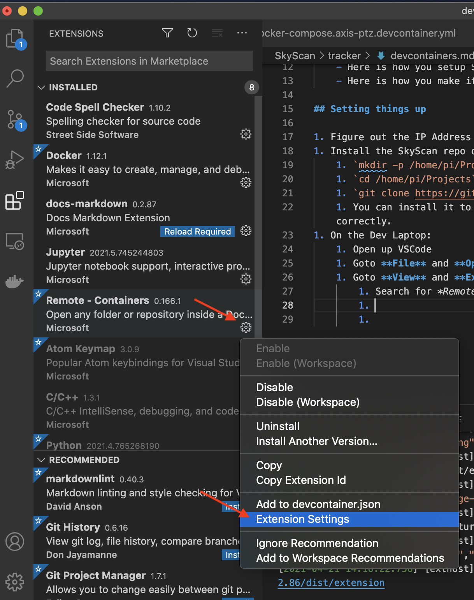
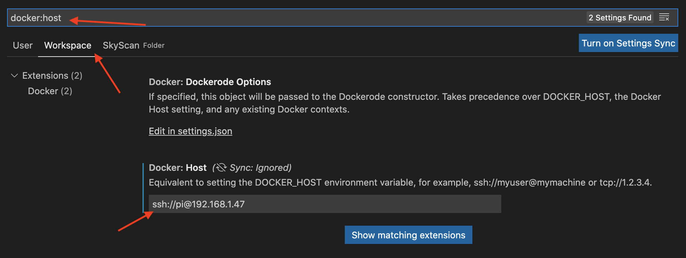
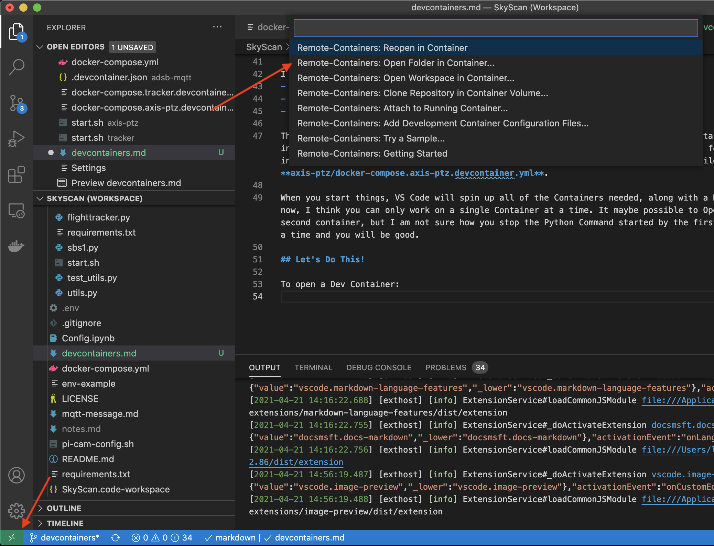

# How to get started using Dev Containers

This should work for the standard setup of SkyScan. There is a dev laptop, where you write code and a Pi that is running the code. 

## Requirements

The basic overview on developing inside a remote container is here: https://code.visualstudio.com/docs/remote/containers-advanced#_developing-inside-a-container-on-a-remote-docker-host

- **Docker**: Both the Laptop and the Pi should have a recent version of Docker installed on them. 
- **VS Code**: Should be installed on the Dev Laptop.
- **Passwordless SSH**: You should be able to SSH to the Pi using your RSA Key. 
    - Here is how you setup SSH on the Pi: https://www.raspberrypi.org/documentation/remote-access/ssh/
    - Here is how you make it passwordless: https://www.raspberrypi.org/documentation/remote-access/ssh/passwordless.md

## Setting things up

1. Figure out the IP Address for the Pi. This should stay static.
1. Install the SkyScan repo on the Pi. I have been installing it at: `/home/pi/Projects/SkyScan`
    1. `mkdir -p /home/pi/Projects`
    1. `cd /home/pi/Projects`
    1. `git clone https://github.com/IQTLabs/SkyScan.git`
    1. You can install it to other Directories, but you will need to modify some of the config files so it gets mapping into the containers correctly.
1. On the Dev Laptop:
    1. Open up VSCode
    1. Goto **File** and **Open Workspace** and select the SkyScan Workspace in the repo folder
    1. Goto **View** and **Extensions**
        1. Search for *Remote - Containers* and install it
        1. Now open the **Extension Settings** for the extension:
        
        1. Select *Workspace Settings** and search for **Docker:Host**
        
        1. Enter the command to SSH to the Pi. My Pi is at *192.168.1.47*, so I have the following command: `ssh://pi@192.168.1.47`
    
    1. Make sure you `.env` file is correctly configured. I am pretty sure that the .env is read in off the Dev Laptop, so you need to have it there. If you figure out it is reading the .env off the Pi, let me know.

## Running Things

It is pretty easy to get things running. I have found it is best to make sure all of the SkyScan containers are stopped on the Pi. This is because you do not want the Container you are going to be working on to be already running. You will want to be able to start and stop the process through the command line inside the terminal. The Dev Container setup starts a dummy process instead of the default Command. This lets you stop the main process without Docker Compose killing the whole container when it is stopped. 

In short, go to the Pi, go to the SkyScan folder and run `docker-compose down`.

I have setup Dev Containers for 2 different SkyScan containers:
- tracker
- axis-ptz

The Dev Container extends the default Docker Compose. It maps the folder with the Container's Python code into the **/workspace** folder inside the Container. Any changes you make in VS Code will be saved into the git repo for SkyScan on the Pi. If you have installed SkyScan into a different location on the Pi, you will need to update the **docker-compose** files in each of these folders on your Dev Laptop, eg **axis-ptz/docker-compose.axis-ptz.devcontainer.yml**.

When you start things, VS Code will spin up all of the Containers needed, along with a Dev Container for the one you are working on. Right now, I think you can only work on a single Container at a time. It maybe possible to Open a Second VS Code Window and start working on a second container, but I am not sure how you stop the Python Command started by the first window. Just stick to working on one Container at a time and you will be good.

## Let's Do This!

To open a Dev Container:
 1. Click the Green Square in the lower left hand corner.
 1. Then select **Open folder in container...**
 1. After that select the folder for the container you want to open (tracker, axis-ptz, adsb-mqtt)
  

After you do this, VS Code should start to bring up the containers on the Pi. You can check on them by logging into the Pi over SSH and running: `docker ps`. You can also follow along by checking out the logs. The initial load can take a while because the Pandas package has to be built from scratch. Once everything has finished, open the terminal by going to: **View** and **Terminal**. Then create a new terminal by clicking on the `+` in the Terminal window pane. 

You should end up at **/workspace**. You are inside your selected container, which is running on the Pi. The **/workspace** folder is mapped into the container, so any changes you make will be saved locally on the Pi. You can use VS Code to open up different files and makes edits. When you are ready to run things, simple run `./start.sh` on the command line in the terminal. This will launch the Python program for the container you are working on using the default command line parameters. All of the environment variables should be brought into the Container (you can check by running `env`) and applied as parameters with you run `./start.sh`.

To stop the program, simply hit: **ctrl+c**

When you are all done, you can click on the Green Square in the lower left hand corner and select **Close Remote Connection**.

